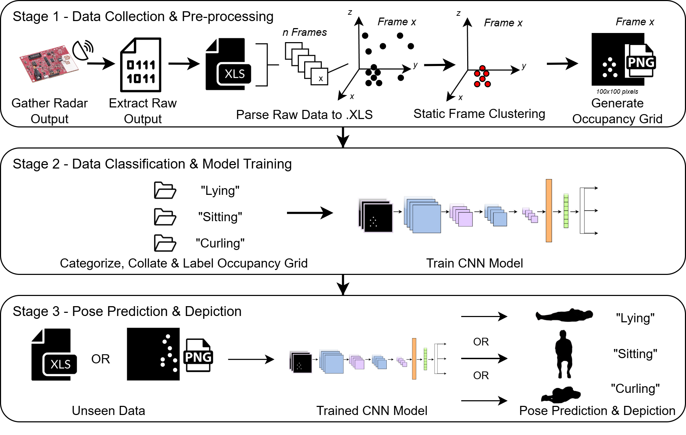
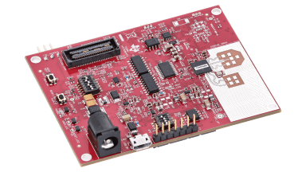

# Single mmWave Radar-Based Pose Detection for Non-Intrusive Patient Monitoring

## A Three-Stage Pipeline to predict and depict a person's pose



## Repository

This repository contains the following folders and code files

> Folders
1. 01_raw_bin - Containing the raw binary files collected from the mmWave Radar
2. 02_parsed - Folder for the parsed binary files
3. 03_occupancy_grid - folder for the generated occupancy grid

> Code Files
1. data_process.ipynb - To proces the raw binary files into readable MS Excel format, read the data, and generate occupancy grids
2. model_training.ipynb - For model training
3. pose_depiction.ipynb - For prediction and depicting the pose

## mmWave Radar Details



[IWRL6432BOOST Evaluation Module](https://www.ti.com/tool/IWRL6432BOOST)

## Radar Configuration

- Demo used - IWRL6432 Out of Box Demo
- Chirp configuration - PresenceDetect.cfg (default configuration provided in the radar toolbox)
  - The configuration is altered to retrieve more point cloud data
- Within the visualizer, a save UART option can be checked, allowing the point cloud to be collected
  - The data points are saved as a .bin file after every 100 frames, and through exiting the tool, remaining frames will be discarded

## Usage
1. Install dependencies from a requirements.txt file
```bash
pip install -r requirements.txt
```
2. Run each .ipynb files in sequence
